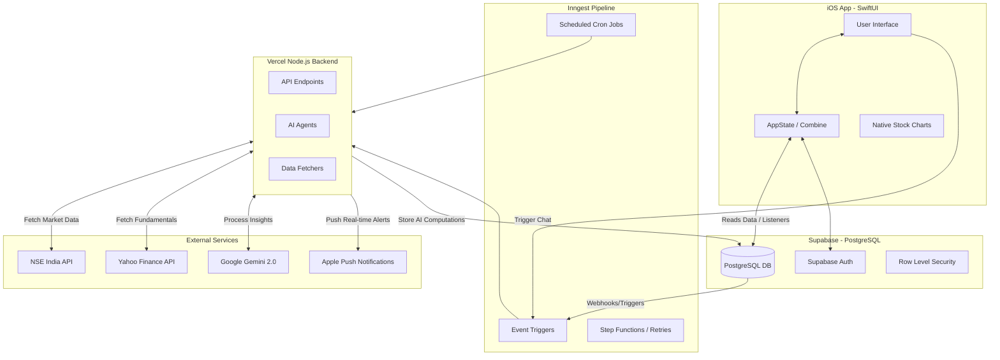

# Stoqk App - Complete Architecture and System Documentation

## 1. System Overview
Stoqk is a next-generation "AI-native" investing application designed to act as a highly personalized, intelligent market analyst for retail investors. Unlike traditional brokerage apps that simply present raw price charts and news feeds, Stoqk actively processes market events, macro-economic indicators, and news through Large Language Models (LLMs). It contextualizes this raw data against the specific user's investment profile, goals, and portfolio holdings to deliver actionable, tailored insights rather than generic advice.

The system is built on a decoupled, serverless architecture:
*   **Frontend:** A native iOS application built with SwiftUI, focusing on fluid animations, premium aesthetics, and responsive charts.
*   **Backend:** A Node.js (TypeScript) serverless environment hosted on Vercel.
*   **Database & Auth:** Supabase (PostgreSQL) is used as the primary data store and authentication provider, leveraging Row Level Security (RLS) for direct client-to-database communication.
*   **Orchestration:** Inngest drives all background jobs, cron schedules, and asynchronous AI workflows, easily bypassing Vercel's standard execution limits.
*   **AI Engine:** Google Gemini 2.0 Flash handles rapid text generation, signal scoring, and conversational analysis.

---

## 2. Architecture Diagram

---

## 3. Technology Stack & Key Decisions

*   **Native iOS (SwiftUI):** Chose native development over cross-platform (React Native/Flutter) to ensure the highest possible UI quality, leveraging native components like Apple's `Charts` framework for smooth, interactive data visualization and `Haptics` for premium user feedback.
*   **Serverless Node.js (Vercel):** Ensures the backend can scale from zero to thousands of requests instantly. The backend strictly focuses on heavy data scraping and AI processing.
*   **Supabase (BaaS):** Eliminates the need for a massive traditional REST API. The iOS app utilizes PostgREST to directly query tables (like `daily_briefs` and `stock_prices`), secured by RLS policies so users only see their own data.
*   **Inngest:** Vercel functions famously terminate after 15 to 60 seconds. Since AI operations and mass data syncing can take minutes, Inngest breaks these long-running tasks into isolated "Steps." If a step fails (e.g., a Gemini rate limit 429 error), Inngest automatically retries just that step without losing progress.
*   **Google Gemini 2.0 Flash:** Chosen as the primary LLM over OpenAI or Claude due to its massive context window (allowing us to feed it the user's entire portfolio alongside market news) and extremely fast time-to-first-token, crucial for a real-time chat feel.

---

## 4. Frontend Application Breakdown (iOS)

The iOS app is structured into feature-based views, managed by a centralized `AppState` observable object.

*   **SplashView:** The initial launch screen featuring an animated braided logo and application title. Uses a `ZStack` with opacity and scale animations to seamlessly transition into the app.
*   **LoginView & OnboardingView:** Handles user authentication. Post-login, new users complete an onboarding survey assessing their risk tolerance, investment timeline, and financial goals. This generates the `profile_block` string, heavily utilized by the backend AI agents.
*   **MainTabView (Dashboard):** The core hub.
    *   *Macro Section:* Displays the latest Nifty and Sensex values.
    *   *Portfolio Summary:* Aggregates the user's current holdings and displays total value and PnL.
    *   *Daily Brief:* Prominently displays the AI-generated morning briefing.
*   **AskView (Market Analyst Chat):** A sophisticated chat interface. When a user submits a query, it is written to the `chat_messages` table via Supabase with a `pending` status. A real-time Supabase listener waits for the backend to update the status to `done`, then renders the response. A two-layered UI is used (Summary visible instantly, "Dig deeper" hidden behind a tap gesture).
*   **Asset Details / Stock Charts:** Integrates Apple's `Charts` framework. By dragging across the line chart, users update a `selectedPoint` state that dynamically refreshes the displayed price and change percentage for that specific day.

---

## 5. Data Pipelines and Sources

Robust data pipelines are critical, as the AI is only as good as the context it receives.

*   **NSE India API (National Stock Exchange):**
    *   *Bulk Deals, Block Deals, Insider Trading (PIT):* Fetched from NSE's market tracking endpoints. These raw events are the lifeblood for the Signal Detection agent.
    *   *Historical Price Data:* Fetched via the `NextApi/GetQuoteApi` endpoint. The backend implements a session cookie manager (`ensureNSESession`) that mimics a browser request to bypass NSE's strict 404/403 anti-bot protections.
*   **Yahoo Finance (yahoo-finance2 library):**
    *   *Macro Indicators:* Fetches high-level indices (`^NSEI` for Nifty 50, `^BSESN` for Sensex), chosen for superior reliability over NSE's volatile index endpoints.
    *   *Company Fundamentals:* Scrapes PE Ratio, ROE, Debt/Equity, Market Cap, and Sector classifications.

---

## 6. AI Agents and System Prompts

The underlying intelligence is distributed among specialized agents, each wrapped around a specific prompt matrix.

### A. Signal Detector Agent (`signal-detector.ts`)
*   **Role:** Evaluates raw corporate filings and determines if an event is significant enough for an investor to care about.
*   **Input:** Raw JSON from the NSE (e.g., A promoter bought 5,000,000 shares).
*   **Sample Prompt:**
    > "You are a sharp financial analyst evaluating raw exchange data.
    > Event: {raw_data}
    > Output a JSON object evaluating this event with:
    > - event_type (string)
    > - significance_score (1-100)
    > - plain_summary (1-2 sentences)
    > - historical_context (why this might matter)"

### B. Alert Priority Agent (`alert-priority.ts`)
*   **Role:** Operates immediately after the Signal Detector. It cross-references a highly-scored signal against a specific user's portfolio and profile to decide if an immediate Push Notification is warranted.
*   **Sample Prompt:**
    > "User Profile: {profile_block}
    > Signal: {signal_summary}
    > Holdings: {user_holdings}
    > Decide if this user MUST receive a push notification right now. Output JSON with should_notify (boolean), urgency (low/med/high), and push_copy (string)."

### C. Daily Brief Agent (`daily-brief.ts`)
*   **Role:** Synthesizes a personalized morning newsletter for the user.
*   **Sample Prompt:**
    > "You are the user's personal wealth manager.
    > Macro Data: {macro_data}
    > Portfolio Context: {portfolio_context}
    > Active Signals: {active_signals}
    > Write a 3-paragraph morning brief tailored exclusively for this user. Tone: Direct, concise, objective."

### D. Market Analyst Chat Agent (`market-analyst-chat.ts`)
*   **Role:** Interactive conversational agent. Provided with the user's complete financial context alongside active web search results.
*   **Output Rule:** Enforces the `---DIG_DEEPER---` markdown constraint, ensuring responses are always presented to the user in dual layers.
*   **Sample Prompt:**
    > "You are a sharp market analyst advising a specific investor.
    > Profile: {profile_block}
    > Portfolio: {portfolio_context}
    > Sector Exposure: {sectorExposure}
    > Rules:
    > 1. ALWAYS answer in two distinct layers separated by the exact marker '---DIG_DEEPER---'.
    > 2. Layer 1 (Summary): A 1-2 sentence sharp, actionable answer the user can read in 5 seconds.
    > 3. Layer 2 (Analysis): The 'meat' of the answer with data, nuance, and logic.
    > Output plain text WITH the '---DIG_DEEPER---' marker separating the two sections."

---

## 7. Backend Scheduled Jobs (Inngest Cron)

Inngest enables complex orchestration for scheduled tasks.

1.  **Macro Sync (`macro-sync`):**
    *   *Schedule:* Weekdays at 8:30 PM IST.
    *   *Task:* Pulls Nifty, Sensex, and computes FII/DII net flows. Runs at 8:30 PM to ensure exchanges have published the final daily capital flows.
2.  **Price Sync (`price-sync`):**
    *   *Schedule:* Weekdays at 4:00 PM IST (post-market close).
    *   *Task:* Loops through tracked top-tier tickers and downloads the latest End-of-Day Open, High, Low, Close, and Volume data.
3.  **Signal Fetch (`signal-fetch`):**
    *   *Schedule:* Every 15 minutes, Monday through Friday.
    *   *Task:* Polls NSE for real-time deals. *Architecture Note:* Contains a 5-second pacing delay loop between processing each signal. This intentionally throttles the execution speed to completely avoid Gemini API 429 ("Too Many Requests") errors while scaling across thousands of users.
4.  **Daily Brief Generator (`daily-brief-generator`):**
    *   *Schedule:* Weekdays at 8:00 AM IST.
    *   *Task:* Iterates through all fully onboarded users, triggering the Daily Brief Agent to prepare their morning dashboard entry.

---

## 8. Database Schema (Supabase PostgreSQL)

*   `user_profiles`: Core profile information, auth IDs, onboarding completion status, and the crucial `profile_block` text.
*   `user_holdings`: Relational table tying a `user_id` to a `ticker` with `qty` and `avg_buy_price`.
*   `user_watchlist`: Secondary tracking for tickers the user is interested in but does not yet own.
*   `company_fundamentals`: Deep tracking of P/E, ROE, Sector, Market Cap.
*   `macro_indicators`: Daily historical log of national indices and repository rates.
*   `stock_prices`: Gigantic table storing daily OHLCV rows per ticker, powering the frontend charts.
*   `signals`: Log of all raw and AI-scored market events.
*   `chat_messages`: Relational history of a user's conversations with the Analyst agent.
*   `daily_briefs`: Personalized daily insights text.
*   `user_notifications`: Queue and record of APNS push notifications sent to the user.

---

## 9. Critical Architectural Decisions

### A. Manual Math vs AI Hallucinations
During development, the AI was originally tasked with calculating the user's Total Portfolio Value, PnL percentages, and Sector Concentration by receiving a raw array of holdings and historical prices. This frequently resulted in "Invalid JSON" truncation errors (timeout) or mathematically incorrect hallucinations. 
**The Solution:** The `buildPortfolioContext` pipeline was rewritten in pure TypeScript. The backend now calculates precise INR values, exact percentages, and aggregates sector weightings iteratively. These *perfect* mathematical figures are then passed *into* the AI's prompt as context. This ensures absolute trust in the numbers while allowing the AI to focus entirely on qualitative analysis.

### B. Inngest Step Implementation for Scalability
Processing a sudden influx of 40 market signals against 100 users requires thousands of AI verifications. A standard Vercel function dies rigidly at 60 seconds, which would silently crash the pipeline. By wrapping the core evaluation logic in `step.run()`, Inngest treats each signal processing unit as an independent, durable execution chunk. If processing "Signal B" causes an API timeout or crashes the container, Inngest pauses, securely logs "Signal A's" success, and restarts exactly at "Signal B" 10 seconds later, ensuring 100% data throughput resilience.

### C. The Two-Layer Chat Abstraction
Standard LLM wrappers in financial apps typically produce massive walls of text that are exhausting to read. To deliver an executive, "concierge" feel, the Stoqk backend forces the AI to construct its answer around a `---DIG_DEEPER---` string marker. The Node.js backend splits the response on this marker before saving it to the database. The SwiftUI iOS application is entirely ignorant of this process; it simply receives a `plain` string and a `deeper` string, allowing for instantaneous, clean UI updates where the complex analytical breakdown is hidden behind an expandable disclosure group.
